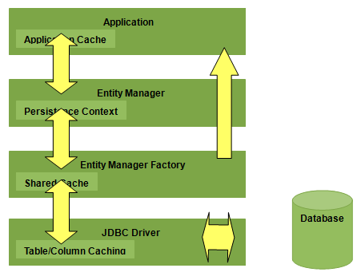

# Entity Management

All objects are stored into an entity manager.

Here is the global view of Entity Manager.

## Entity Manager

A place to stor all entitys

## Entity Query

An object to define a query to run on entity manager

We do not support string query.

## Entity Description

### PHP Description

### Attributes

